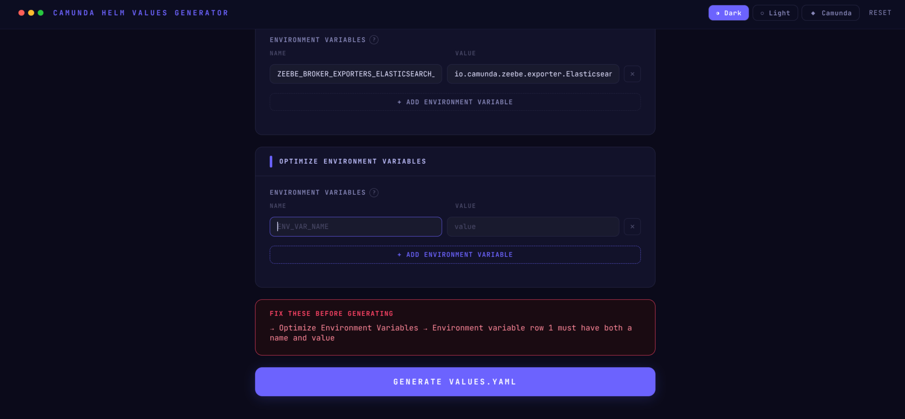
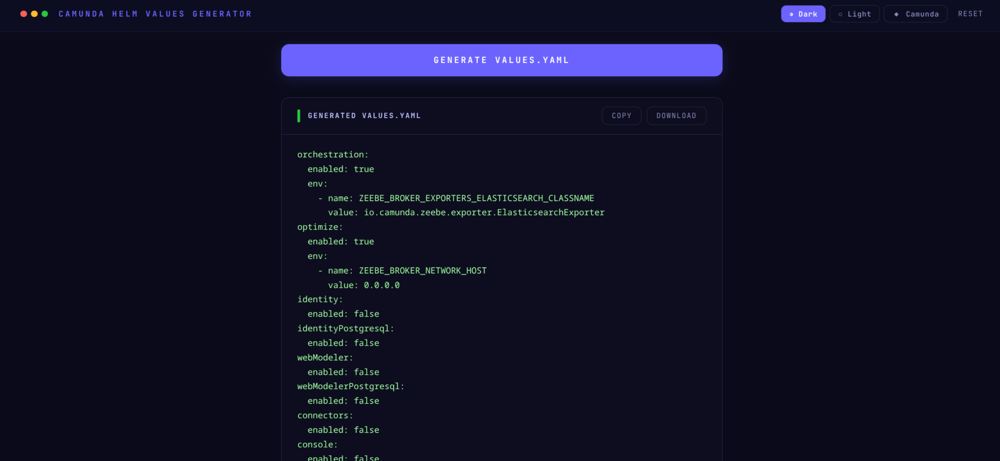
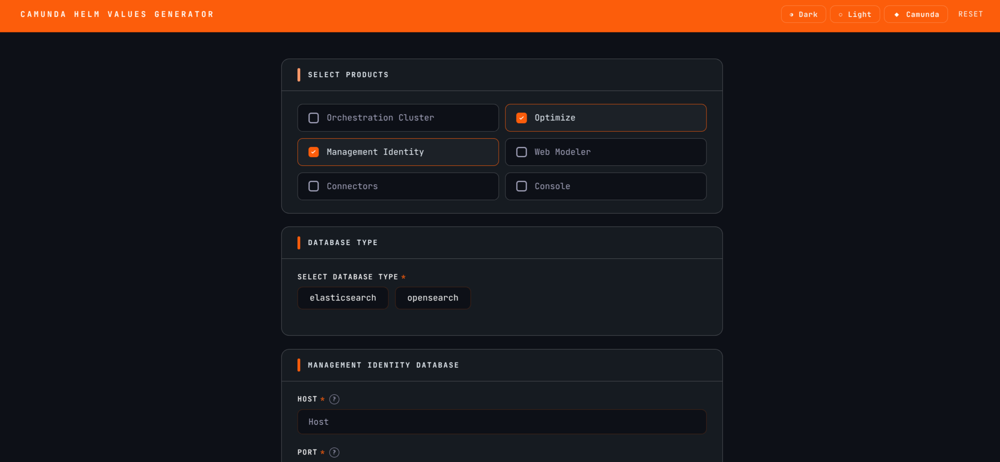
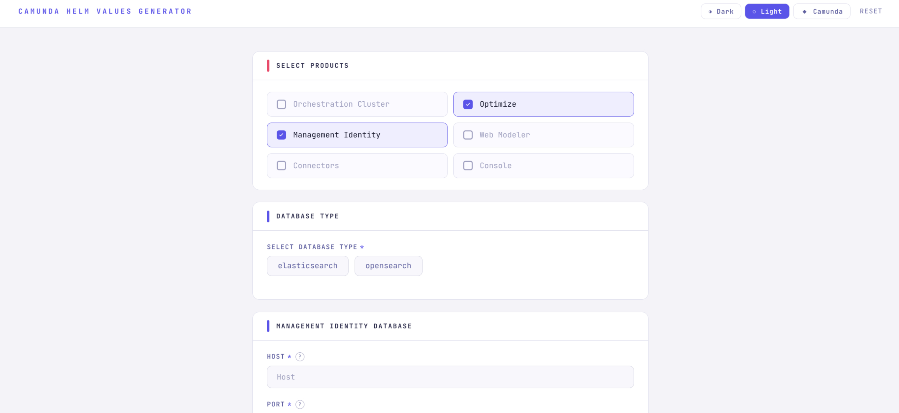

# Camunda Helm Values Generator

A web-based tool for generating `values.yaml` override files for deploying [Camunda Platform 8](https://camunda.com) on Kubernetes using Helm.

**Live demo:** [cphc-values-wizard.vercel.app](https://cphc-values-wizard.vercel.app/)

---

## The Problem

Deploying Camunda Platform 8 with Helm requires a `values.yaml` configuration file that can span hundreds of lines. It demands a detailed understanding of which fields to set, which to leave at defaults. A single misconfiguration can break the entire deployment.

## The Solution

Fill in a form. Get a correct, minimal `values.yaml`. Done.

The tool surfaces only the fields users actually need to configure, handles all implicit Helm requirements automatically, and outputs a file ready for use with `helm install`, without needing to understand the full chart structure.

---

## Features

**Configuration**
- **Schema-driven UI** — the form builds itself from the official Camunda Helm chart values file. No fields are hardcoded
- **Conditional sections** — only relevant configuration appears based on product selection
- **Shared vs standalone database** — automatically shows the correct database section depending on which products are selected
- **Automatic Helm flags** — required values like `enabled`, `external`, and bundled database flags are set without user input
- **Cross-component validation** — the chart's own constraints (Console and Web Modeler require Identity, and so on) are checked in the form instead of at `helm install`
- **Import an existing values.yaml** — load a file you deployed earlier, change one thing, regenerate. Anything the form cannot represent is reported rather than silently dropped

**Production concerns**
- **Cluster sizing from a throughput target** — enter "1000 process instances per second" and get broker count, partition count, replication factor and resources, calibrated against Camunda's benchmark data
- **Multi-region** — generates the full cross-region broker contact point list, which the chart cannot compute itself
- **Existing Kubernetes secrets** — reference pre-created secrets instead of writing credentials in plaintext
- **OIDC authentication** — configure an external identity provider
- **Document stores** — S3 (with IRSA) or GCS instead of the default in-memory store, which loses documents on restart
- **OpenShift and AWS EKS** — security context adaptation and IRSA set across every sub-chart

**Everyday**
- **Environment variables** — dynamic per-product env var editor
- **Field hints** — hover the `?` icon on any field to see its description pulled directly from the Helm chart
- **Chart version shown** — the footer states exactly which chart release the output targets
- **Three themes** — Dark, Light, and Camunda brand, persisted across sessions
- **Copy or download** — export your `values.yaml` directly from the browser

## Tech Stack

| Layer | Technology |
|---|---|
| UI | React 19 + Vite |
| YAML parsing & generation | js-yaml |
| Schema extraction | Node.js (build-time script) |
| Tests | Vitest + golden files + `helm template` |
| Styling | CSS |

---

## Getting Started

### Prerequisites

- Node.js 18+
- npm

### Installation

```bash
git clone https://github.com/your-username/camunda-helm-values-generator
cd camunda-helm-values-generator
npm install
```

### Start the development server

```bash
npm run dev
```

Open [http://localhost:5173](http://localhost:5173) in your browser. `src/schema.json`
is committed, so no build step is needed first.

### Commands

| Command | What it does |
|---|---|
| `npm run dev` | Dev server on :5173 |
| `npm run build` | Production build |
| `npm run lint` | ESLint |
| `npm test` | Unit tests and golden files (`npm test -- -u` to re-record) |
| `npm run validate` | Checks every Helm path the tool can emit exists in the chart |
| `npm run verify:helm` | Renders every test scenario against the real chart (needs `helm`) |
| `npm run parse` | Regenerates `src/schema.json` from `public/values.yaml` |
| `npm run fixtures` | Writes a values.yaml per test scenario to `tmp/fixtures/` |

`npm run verify:helm` is the one that matters most: it proves the chart actually
**accepts** the generated file. Unit tests only prove the output is what we intended.

---

## Usage

1. **Select products** — check the Camunda components you want to deploy
2. **Choose your database** — Elasticsearch or OpenSearch (shown only when relevant)
3. **Fill in connection details** — host, port, credentials. Use *Existing secret*
   mode to reference a Kubernetes Secret rather than writing the password into the file
4. **Size the cluster** — pick *Throughput target* and enter your expected process
   instances per second; the computed topology is shown before you generate
5. **Multi-region (optional)** — tick the box, give one namespace per region, and
   generate the file once per region changing only the region ID
6. **Generate** — review any validation errors, then copy or download

To revise an existing deployment, use **Import values.yaml** in the header rather
than filling the form in again. Anything the form cannot represent is listed so
you can carry it across by hand.

## Project Structure

```
├── docs/
│   ├── architecture.md          Architecture and developer guide — start here
│   └── screenshots/             UI screenshots
├── public/
│   └── values.yaml              Camunda Helm chart values (vendored, source of truth)
├── scripts/
│   ├── parseValues.js           Extracts schema.json from values.yaml
│   ├── validatePaths.js         Checks every emitted path against the chart
│   ├── renderFixtures.js        Writes a values.yaml per test scenario
│   └── helmTemplateCheck.sh     Renders those fixtures against the real chart
├── src/
│   ├── schema.json              Generated — do not edit manually
│   ├── chartMeta.json           Generated — which chart release this targets
│   ├── displayConfig.js         Which fields are shown, when, and their constraints
│   ├── transform.js             Converts form answers to Helm values
│   ├── sizing.js                Throughput target → cluster topology
│   ├── importValues.js          Reads an existing values.yaml back into the form
│   ├── App.jsx                  React UI
│   └── styles/
├── test/
│   ├── scenarios.js             Deployment shapes, shared by tests and helm check
│   ├── golden/                  Expected YAML output, reviewed in pull requests
│   └── *.test.js
├── index.html
├── package.json                 camundaChart declares the pinned chart version
└── README.md
```

## Updating for a New Chart Version

```bash
helm show values camunda/camunda-platform --version <new> > public/values.yaml
# update camundaChart.version and appVersion in package.json
npm run parse && npm run validate && npm test -- -u && npm run verify:helm
```

`npm run validate` reports paths the new chart renamed or removed;
`npm run verify:helm` catches newly required values and new cross-component
constraints. Neither step is optional — the 14.8.5 upgrade removed
`webModeler.webapp.env` and revealed that `webModeler.restapi.mail.fromAddress`
is mandatory, and nothing else would have caught either.

Full procedure in [docs/architecture.md](docs/architecture.md#upgrading-to-a-new-chart-version).

## Extending the Tool

### Adding a new field

1. Open `src/schema.json` and search for the field by keyword to find its path
2. Add a field entry to the relevant section in `src/displayConfig.js`:

```javascript
{
  id: 'unique_id',
  path: 'the.exact.path.from.schema',
  label: 'Label shown to user',
  type: 'text',        // text | password | radio | checkbox | env_vars
  required: true
}
```

3. Run `npm run validate` to confirm the path exists in the chart
4. Save - the UI reflects the change automatically

A field may also carry its own `showIf` to appear conditionally within an
otherwise visible section. Hidden fields are never required and never written to
the output.

### Adding a new section

Add a section object to the `sections` array in `src/displayConfig.js` with a `showIf` condition:

```javascript
{
  id: 'mySection',
  title: 'My Section Title',
  showIf: (answers) => answers.products.includes('myProduct'),
  fields: [ ... ]
}
```

The position of the section in the array determines its order in the UI.

---

## Screenshots






---

## Acknowledgements

Built on top of the foundation laid by the [Camunda Community Hub](https://github.com/camunda-community-hub).

---

## License

This project is licensed under the [MIT License](LICENSE).